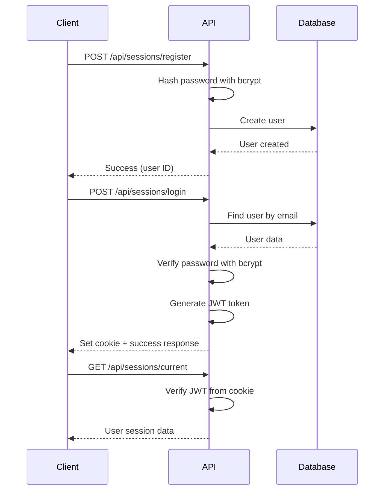

The Adoptme API uses JWT (JSON Web Tokens) for authentication, combined with bcrypt for secure password hashing. Authentication is handled through cookie-based sessions.

## Authentication flow



## Registration

New users register by providing their basic information. Passwords are hashed before storage.

**Endpoint**: `POST /api/sessions/register`

**Implementation** (`controllers/sessions.controller.js:6`):

```javascript
const register = async (req, res) => {
  try {
    const { first_name, last_name, email, password } = req.body;
    
    // Validate required fields
    if (!first_name || !last_name || !email || !password) {
      return res.status(400).send({ 
        status: "error", 
        error: "Incomplete values" 
      });
    }
    
    // Check if user already exists
    const exists = await usersService.getUserByEmail(email);
    if (exists) {
      return res.status(400).send({ 
        status: "error", 
        error: "User already exists" 
      });
    }
    
    // Hash password
    const hashedPassword = await createHash(password);
    
    // Create user
    const user = {
      first_name,
      last_name,
      email,
      password: hashedPassword
    }
    
    let result = await usersService.create(user);
    res.send({ status: "success", payload: result._id });
  } catch (error) {
    res.status(500).send("Ha ocurrido un error en la petición")
  }
}
```

### Password hashing

Passwords are hashed using bcrypt with a salt rounds value of 10.

**Implementation** (`utils/index.js:5`):

```javascript
export const createHash = async(password) => {
  const salts = await bcrypt.genSalt(10);
  return bcrypt.hash(password, salts);
}
```

**Security features**:
- **Salt generation**: Each password gets a unique salt
- **10 rounds**: Balances security and performance
- **One-way hashing**: Passwords cannot be reversed

## Login

Users authenticate by providing their email and password. Upon successful authentication, a JWT token is generated and stored in a cookie.

**Endpoint**: `POST /api/sessions/login`

**Implementation** (`controllers/sessions.controller.js:27`):

```javascript
const login = async (req, res) => {
  try {
    const { email, password } = req.body;
    
    // Validate input
    if (!email || !password) {
      return res.status(400).send({ 
        status: "error", 
        error: "Incomplete values" 
      });
    }
    
    // Find user
    const user = await usersService.getUserByEmail(email);
    if (!user) {
      return res.status(404).send({
        status: "error",
        error: "User doesn't exist"
      });
    }
    
    // Verify password
    const isValidPassword = await passwordValidation(user, password);
    if (!isValidPassword) {
      return res.status(400).send({
        status: "error",
        error: "Incorrect password"
      });
    }
    
    // Generate JWT token
    const userDto = UserDTO.getUserTokenFrom(user);
    const token = jwt.sign(userDto, 'tokenSecretJWT', {expiresIn: "1h"});
    
    // Set cookie and respond
    res.cookie('coderCookie', token, {maxAge: 3600000})
       .send({status: "success", message: "Logged in"})
  } catch (error) {
    res.status(500).send("Ha ocurrido un error en la petición")
  }
}
```

### Password verification

Password verification uses bcrypt's compare function:

**Implementation** (`utils/index.js:10`):

```javascript
export const passwordValidation = async(user, password) => 
  bcrypt.compare(password, user.password);
```

## JWT tokens

JWT tokens contain user information and are signed with a secret key.

### Token payload

The token payload is created using a UserDTO that includes only safe user information:

```javascript
static getUserTokenFrom = (user) => ({
  name: `${user.first_name} ${user.last_name}`,
  role: user.role,
  email: user.email
})
```

**Excluded data**: Password hash and other sensitive information are never included in tokens.

### Token configuration

- **Secret**: `'tokenSecretJWT'` (should be environment variable in production)
- **Expiration**: 1 hour (`expiresIn: "1h"`)
- **Storage**: HTTP cookie named `coderCookie`
- **Cookie max age**: 3600000ms (1 hour)

## Session management

### Current session

Retrieve the current authenticated user's information from their session token.

**Endpoint**: `GET /api/sessions/current`

**Implementation** (`controllers/sessions.controller.js:43`):

```javascript
const current = async(req, res) => {
  try {
    const cookie = req.cookies['coderCookie']
    const user = jwt.verify(cookie, 'tokenSecretJWT');
    
    if (user) {
      return res.send({status: "success", payload: user})
    }
  } catch (error) {
    res.status(500).send("Ha ocurrido un error en la petición")
  }
}
```

### Token verification

The JWT is extracted from the cookie and verified using the same secret key used for signing. If valid, the decoded user information is returned.

## Security considerations

<Warning>
  The current implementation uses a hardcoded JWT secret (`'tokenSecretJWT'`). In production, this should be stored in an environment variable.
</Warning>

### Best practices implemented

1. **Password hashing**: All passwords are hashed with bcrypt before storage
2. **Salt generation**: Each password gets a unique salt
3. **Token expiration**: JWT tokens expire after 1 hour
4. **DTO usage**: Sensitive data is filtered out before token generation
5. **Email uniqueness**: Duplicate email registrations are prevented

### Additional security recommendations

- Store JWT secret in environment variables
- Use HTTPS in production
- Implement rate limiting on auth endpoints
- Add refresh token mechanism for longer sessions
- Consider adding CSRF protection
- Implement account lockout after failed login attempts

## Authentication middleware

While not shown in the current implementation, protected routes should use middleware to verify JWT tokens:

```javascript
const authMiddleware = (req, res, next) => {
  try {
    const token = req.cookies['coderCookie'];
    const user = jwt.verify(token, process.env.JWT_SECRET);
    req.user = user;
    next();
  } catch (error) {
    res.status(401).send({ status: "error", error: "Unauthorized" });
  }
}
```

Apply this middleware to protected routes:

```javascript
router.get('/protected', authMiddleware, protectedController);
```
