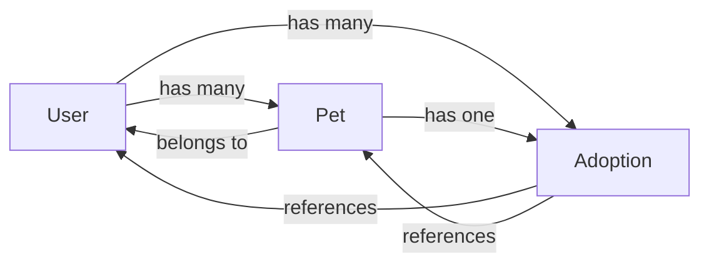

The Adoptme API uses MongoDB with Mongoose for data persistence. The application has three core data models: User, Pet, and Adoption.

## User model

The User model represents registered users of the platform who can adopt pets.

**Schema definition** (`dao/models/User.js`):

```javascript
const schema = new mongoose.Schema({
  first_name: {
    type: String,
    required: true
  },
  last_name: {
    type: String,
    required: true
  },
  email: {
    type: String,
    required: true,
    unique: true
  },
  password: {
    type: String,
    required: true
  },
  role: {
    type: String,
    default: 'user'
  },
  pets: {
    type: [{
      _id: {
        type: mongoose.SchemaTypes.ObjectId,
        ref: 'Pets'
      }
    }],
    default: []
  }
})
```

### Fields

<ResponseField name="first_name" type="string" required>
  User's first name
</ResponseField>

<ResponseField name="last_name" type="string" required>
  User's last name
</ResponseField>

<ResponseField name="email" type="string" required>
  User's email address. Must be unique across all users
</ResponseField>

<ResponseField name="password" type="string" required>
  Hashed password using bcrypt. Never store plain text passwords
</ResponseField>

<ResponseField name="role" type="string" default="user">
  User's role in the system (e.g., "user", "admin")
</ResponseField>

<ResponseField name="pets" type="array" default="[]">
  Array of ObjectId references to Pet documents that the user has adopted
</ResponseField>

## Pet model

The Pet model represents animals available for adoption or already adopted.

**Schema definition** (`dao/models/Pet.js`):

```javascript
const schema = new mongoose.Schema({
  name: {
    type: String,
    required: true,
  },
  specie: {
    type: String,
    required: true
  },
  birthDate: Date,
  adopted: {
    type: Boolean,
    default: false
  },
  owner: {
    type: mongoose.SchemaTypes.ObjectId,
    ref: 'Users'
  },
  image: String
})
```

### Fields

<ResponseField name="name" type="string" required>
  Pet's name
</ResponseField>

<ResponseField name="specie" type="string" required>
  Pet's species (e.g., "dog", "cat", "bird")
</ResponseField>

<ResponseField name="birthDate" type="date">
  Pet's date of birth
</ResponseField>

<ResponseField name="adopted" type="boolean" default="false">
  Whether the pet has been adopted
</ResponseField>

<ResponseField name="owner" type="ObjectId">
  Reference to the User document who adopted the pet. Populated when `adopted` is true
</ResponseField>

<ResponseField name="image" type="string">
  URL or path to the pet's image
</ResponseField>

## Adoption model

The Adoption model creates a record of each adoption transaction, linking a user to a pet.

**Schema definition** (`dao/models/Adoption.js`):

```javascript
const schema = new mongoose.Schema({
  owner: {
    type: mongoose.SchemaTypes.ObjectId,
    ref: 'Users'
  },
  pet: {
    type: mongoose.SchemaTypes.ObjectId,
    ref: 'Pets'
  }
})
```

### Fields

<ResponseField name="owner" type="ObjectId">
  Reference to the User document who adopted the pet
</ResponseField>

<ResponseField name="pet" type="ObjectId">
  Reference to the Pet document that was adopted
</ResponseField>

## Model relationships

The three models are interconnected through MongoDB references:



### User ↔ Pet relationship

- **One-to-many**: A user can adopt multiple pets
- **Reference storage**: The User model stores an array of Pet `_id` values in the `pets` field
- **Bidirectional**: The Pet model stores the owner's `_id` in the `owner` field

### Adoption records

- The Adoption model creates a permanent record of each adoption
- Each Adoption document references both a User (owner) and a Pet
- This provides an audit trail of all adoptions in the system

## Data Transfer Objects

DTOs are used to transform model data for specific use cases:

### UserDTO

Extracts safe user information for JWT tokens:

```javascript
static getUserTokenFrom = (user) => ({
  name: `${user.first_name} ${user.last_name}`,
  role: user.role,
  email: user.email
})
```

**Note**: The password field is never included in DTOs.

### PetDTO

Prepares pet data for creation:

```javascript
static getPetInputFrom = (pet) => ({
  name: pet.name || '',
  specie: pet.specie || '',
  image: pet.image || '',
  birthDate: pet.birthDate || '12-30-2000',
  adopted: false
})
```

## Collections

The models are stored in the following MongoDB collections:

- **Users**: User accounts and authentication data
- **Pets**: Pet profiles and adoption status
- **Adoptions**: Adoption transaction records
